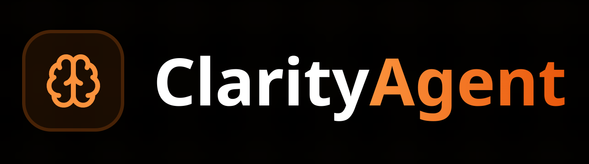

# 🤖 Clarity Agent

> The Ultimate AI-Powered Development Platform for Stacks Smart Contracts

Clarity Agent is a comprehensive suite of AI-powered tools designed to streamline the development, testing, and deployment of smart contracts on the Stacks blockchain. By combining cutting-edge artificial intelligence with blockchain expertise, we provide developers with an intuitive platform to build secure and efficient Clarity contracts.



## 🎥 Demo Video
Check out our demo video to see Clarity Agent in action: [Watch Demo](https://youtu.be/rZAjNDlkY4Q)


## 🎯 Problem Statement

Smart contract development on the Stacks blockchain presents several challenges:
- High barrier to entry for developers new to Clarity language
- Time-consuming and error-prone manual security auditing processes
- Complex debugging and analysis of deployed contracts
- Lack of automated testing tools specifically designed for Clarity contracts
- Limited real-time assistance during development

Clarity Agent addresses these challenges by providing an integrated AI-powered platform that streamlines the entire smart contract development lifecycle on Stacks.

## 🔍 Technical Approach

### Architecture Overview
The platform implements a modern, scalable architecture:

1. **Frontend Layer**
   - React 18 with TypeScript for type-safe component development
   - Vite for optimized build performance and hot module replacement
   - Radix UI primitives ensuring accessibility and consistent behavior
   - Tailwind CSS for responsive, utility-first styling
   - Real-time updates via WebSocket connections

2. **Backend Services**
   - Node.js/Express server with modular route handling
   - PostgreSQL database for persistent storage
   - DeepSeek integration for intelligent code analysis and generation
   - WebSocket server for live updates and real-time assistance
   - RESTful API design for scalable service integration

3. **AI Integration**
   - Contract analysis using DeepSeek Code models
   - Pattern recognition for security vulnerability detection
   - Automated test case generation based on contract logic
   - Context-aware code completion and suggestions
   - Real-time development guidance through AI assistant

4. **Blockchain Integration**
   - Direct interaction with Stacks blockchain
   - Real-time contract state monitoring
   - Transaction analysis and visualization
   - Automated deployment and verification
   - Gas optimization recommendations

## ✨ Core Features

### 🏗️ Contract Builder
**AI-driven development and analysis tools for Stacks smart contracts**
- Intelligent code completion and suggestions
- Real-time syntax validation and error detection
- Built-in design patterns and best practices
- Interactive development environment
- Visual contract structure visualization

### 🔍 Contract Decoder
**Comprehensive analysis and understanding of Stacks contracts**
- Deep dive transaction analysis
- Function call tracing and visualization
- Event logging and monitoring
- Interactive call graph exploration
- Historical transaction patterns

### 🛡️ Auditor Agent
**AI-powered security analysis and vulnerability detection**
- Automated vulnerability scanning
- Common attack vector detection
- Gas optimization recommendations
- Clarity-specific security patterns
- Comprehensive audit reports

### 🔎 Contract Explorer
**Interactive analysis of deployed Stacks contracts**
- Real-time contract state monitoring
- Visual transaction flow analysis
- Contract interaction simulation
- Address tracking and labeling
- Custom watchlists and alerts

### 🧪 Contract Tester
**Automated test generation for Stacks contracts**
- AI-generated test scenarios
- Edge case detection
- Comprehensive coverage analysis
- Automated regression testing
- Custom test suite management

### 💡 Stacks AI Assistant
**Real-time development guidance**
- Context-aware code suggestions
- Best practice recommendations
- Optimization tips
- Interactive problem solving
- Stacks-specific documentation

## 🚀 Development Setup

### Prerequisites

1. **System Requirements**
   - Linux/macOS/Windows WSL2
   - Node.js v18.x or higher
   - PostgreSQL 15+

2. **Development Tools**
   - Visual Studio Code with extensions:
     - ESLint
     - Prettier
     - TypeScript and JavaScript Language Features
   - Git 2.x+
   - Stacks CLI
   - Clarity CLI

### Environment Setup

1. **Clone Repository**
```bash
# Clone the repository
git clone https://github.com/yourusername/clarity-agent.git
cd clarity-agent

# Install global dependencies
npm install -g typescript@4.9.x @graphql-codegen/cli@2.x clarity-cli@2.x
```

2. **Install Project Dependencies**
```bash
# Install dependencies
npm install

# Build the project
npm run build
```

3. **Database Setup**
```bash
# Create database
createdb clarity_agent_dev

# Run database migrations
npm run migrate

# Seed initial data
npm run seed
```

4. **Configure Development Environment**

Create configuration files:

`.env.development`:
```env
# Core Settings
NODE_ENV=development
PORT=3000
LOG_LEVEL=debug
ENABLE_SWAGGER=true

# Database Configuration
POSTGRES_HOST=localhost
POSTGRES_PORT=5432
POSTGRES_USER=your_username
POSTGRES_PASSWORD=your_password
POSTGRES_DB=clarity_agent_dev
DATABASE_URL=postgresql://${POSTGRES_USER}:${POSTGRES_PASSWORD}@${POSTGRES_HOST}:${POSTGRES_PORT}/${POSTGRES_DB}

# AI Service Configuration
DEEPSEEK_API_KEY=your_api_key_here
DEEPSEEK_MODEL=deepseek-coder-33b-instruct
MODEL_CACHE_TTL=3600
ENABLE_STREAMING=true

# Blockchain Configuration
STACKS_NETWORK=testnet
STACKS_API_URL=https://stacks-node-api.testnet.stacks.co
STACKS_WS_URL=wss://stacks-node-api.testnet.stacks.co/extended/v1/ws
CLARITY_ANALYSIS_API_URL=http://localhost:3001

# Security Settings
JWT_SECRET=your_jwt_secret_key
JWT_EXPIRY=24h
COOKIE_SECRET=your_cookie_secret
CORS_ORIGINS=http://localhost:3000,http://localhost:3001
RATE_LIMIT_WINDOW=900000
RATE_LIMIT_MAX=100

# Feature Flags
ENABLE_AI_SUGGESTIONS=true
ENABLE_REAL_TIME_ANALYSIS=true
ENABLE_ADVANCED_DEBUGGING=true
```

5. **Configure Development Tools**

`.vscode/settings.json`:
```json
{
  "editor.formatOnSave": true,
  "editor.codeActionsOnSave": {
    "source.fixAll.eslint": true
  },
  "typescript.tsdk": "node_modules/typescript/lib",
  "typescript.enablePromptUseWorkspaceTsdk": true,
  "[typescript]": {
    "editor.defaultFormatter": "esbenp.prettier-vscode"
  }
}
```

6. **Start Development Services**

```bash
# Terminal 1: Start API server
npm run server:dev

# Terminal 2: Start frontend
npm run client:dev
```

7. **Verify Installation**

```bash
# Run tests
npm run test

# Check service health
curl http://localhost:3000/health
```

## 📁 Project Structure

```
clarity-agent/
├── client/                 # Frontend application
│   ├── public/            # Static assets
│   └── src/
│       ├── components/    # React components
│       ├── hooks/        # Custom React hooks
│       ├── lib/          # Utility functions
│       ├── pages/        # Page components
│       └── types/        # TypeScript definitions
├── server/                # Backend server
│   ├── routes/           # API routes
│   ├── config/           # Server configuration
│   └── types/            # TypeScript definitions
└── db/                   # Database schema and migrations
```
## 👥 Team

- [Sahil Wasnik](https://github.com/0xsy3)
- [Shlok Jagtap](https://github.com/DeImOs-Sj)


## 🔮 Future Improvements

1. **Enhanced AI Capabilities**
   - Integration with multiple DeepSeek models for specialized tasks
   - Fine-tuned models trained on Clarity-specific code
   - Improved code generation accuracy
   - Advanced pattern recognition for security analysis

2. **Developer Experience**
   - Visual contract flow designer
   - Interactive debugging tools
   - Collaborative development features
   - Integrated documentation browser
   - Custom snippet management

3. **Testing and Analysis**
   - Fuzzing capabilities for automated testing
   - Property-based testing integration
   - Advanced simulation environments
   - Performance benchmarking tools
   - Coverage-guided testing

4. **Platform Features**
   - Template marketplace for common contract patterns
   - Integration with popular IDEs
   - Mobile companion app
   - Advanced analytics dashboard
   - Community-driven contract library

5. **Security and Compliance**
   - Formal verification integration
   - Compliance checklist automation
   - Regular security pattern updates
   - Automated audit report generation
   - Risk scoring system

## 🤝 Contributing

We welcome contributions from the community! Here's how you can help:

1. Fork the repository
2. Create a feature branch (`git checkout -b feature/AmazingFeature`)
3. Commit your changes (`git commit -m 'Add some AmazingFeature'`)
4. Push to the branch (`git push origin feature/AmazingFeature`)
5. Open a Pull Request

## 📄 License

This project is licensed under the MIT License - see the [LICENSE](LICENSE) file for details.
